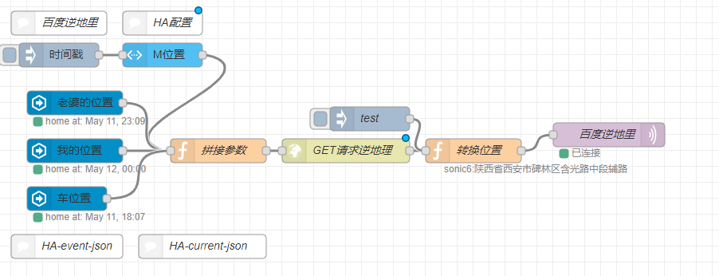
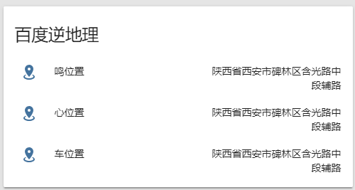

# 百度逆地理

## node-red




## Ha



yaml

```yaml
# https://www.home-assistant.io/components/sensor.mqtt/
# 高德逆地理
# 根据高德API,NODE获取用户坐标信息转换地址
# group.gaode_node

sensor:
  - platform: mqtt
    name: "m_loc"
    state_topic: "baidu/location/sonic6"
    value_template: "{{ value}}"
  - platform: mqtt
    name: "x_loc"
    state_topic: "baidu/location/xiner"
    value_template: "{{ value}}"
  - platform: mqtt
    name: "car_loc"
    state_topic: "baidu/location/atenza"
    value_template: "{{ value}}"

#自定义名称
homeassistant:
  customize_glob:
    sensor.*_loc:
      icon: mdi:google-maps
  customize:
    sensor.m_loc:
      friendly_name: 鸣位置
    sensor.x_loc:
      friendly_name: 心位置
    sensor.car_loc:
      friendly_name: 车位置

#分组
group:
  gaode_node:
    name: 逆地理
    view: no
    entities:
      - sensor.m_loc
      - sensor.x_loc
      - sensor.car_loc
```

